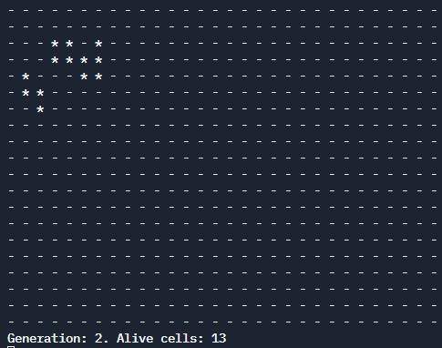
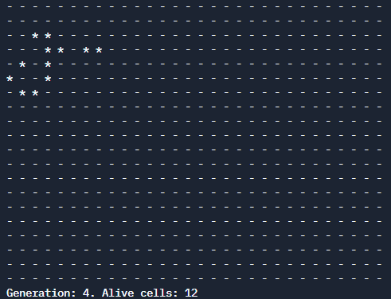
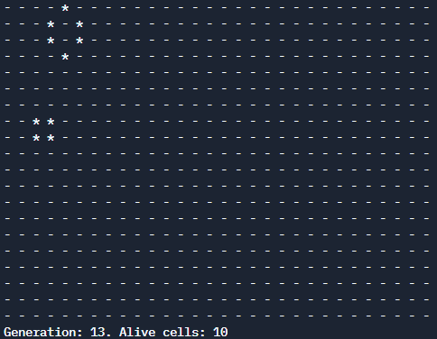

# Курсовой проект «Игра "Жизнь"»

Курсовой проект — упрощённая консольная реализация игры «Жизнь», придуманная английским математиком Джоном Конвеем в 1970 году.

## Содержание

### 1. Правила игры
Место действия игры — Вселенная. Это размеченная на клетки ограниченная плоскость.

Каждая клетка на этой плоскости может находиться в двух состояниях: быть «живой», то есть заполненной, или быть «мёртвой», то есть пустой. Клетка имеет восемь соседей, окружающих её.

Распределение живых клеток в начале игры называется первым поколением. Каждое следующее поколение рассчитывается на основе предыдущего по правилам:
1. В пустой (мёртвой) клетке, рядом с которой ровно три живых клетки, зарождается жизнь.
2. Если у живой клетки есть две или три живых соседки, то эта клетка продолжает жить. В противном случае, если соседей меньше двух или больше трёх, клетка умирает «от одиночества» или «от перенаселённости».

Игра прекращается, если:
-   на поле не останется ни одной «живой» клетки;
-   при очередном шаге ни одна из клеток не меняет своего состояния, то есть складывается стабильная конфигурация.
  
Игрок не принимает прямого участия в игре, а только расставляет начальную конфигурацию «живых» клеток, которые затем взаимодействуют согласно правилам уже без его участия. Он является наблюдателем.

### 2. Требования к решению

Реализация должна удовлетворять требованиям и ограничениям:
1. Текущее состояние Вселенной выводится на консоль в виде таблицы из символов, разделённых пробелом. Мёртвая клетка помечается символом `-`, живая клетка помечается символом `*`. Ниже приведены примеры.
2. На каждом шаге на консоль должно выводиться текущее состояние Вселенной, а также информация о номере поколения и количестве живых клеток на текущий момент.
3. При завершении игры на консоли должно присутствовать состояние Вселенной на момент окончания игры, номер поколения, количество живых клеток и причина завершения игры.
4. При расчёте состояния клеток на границах игрового поля учитываются только соседние клетки. У клеток на границе игрового поля соседних клеток будет меньше 8.
5. Для инициализации Вселенной использовать текстовый файл. Файл имеет структуру: первые два числа — это количество строк и количество столбцов в сетке Вселенной. Затем идёт информация о распределении живых клеток. Распределение состоит из неопределённого количества пар чисел, где каждая пара состоит из номера строки и номера столбца живой клетки.

Примеры входного файла, соответствующее ему начальное состояние Вселенной и конечное состояние:

##### Пример 1
```
20 30
2 3
2 4
3 4
3 5
3 6
3 7
5 0
5 1
5 2
6 2
```  


##### Пример 2
```
10 10
```  

##### Пример 3
```
3 3
0 0
0 1
0 2
1 0
1 1
1 2
2 0
2 1
2 2
```  


### 3. Дополнительный материал
1. При выводе на консоль каждого следующего состояния у вас никуда не денутся те состояния, которые вы выводили ранее. Это может быть полезно для сохранения истории развития вашей Вселенной, но при этом может выглядеть не совсем эстетично.
Альтернативный вариант — очищать консоль перед каждым выводом следующего состояния. Для этого можно использовать функцию `std::system` с аргументом `"clear"`, то есть вызвать функцию `std::system("clear");`. Эта функция находится в библиотеке `<cstdlib>`.
2. Компьютеры сейчас работают быстро, поэтому без дополнительных действий состояния будут сменять друг друга практически мгновенно. Для комфортного просмотра разумно добавить задержку примерно в 1 секунду перед каждым следующим вычислением нового состояния. Для этого необходимо подключить библиотеку `<unistd.h>` и использовать функцию `sleep`, которая принимает на вход количество секунд, на которое надо задержаться. Для задержки на 1 секунду необходимо вызвать `sleep(1);`.

### 4. Пример пошаговой работы программы
Входной файл:
```
20 30
2 3
2 4
3 4
3 5
3 6
3 7
5 0
5 1
5 2
6 2
```









### 4. С чего начать
Сначала нужно понять, как вы собираетесь хранить информацию о состоянии игрового поля. Не забывайте, что вам нужно хранить предыдущее состояние, чтобы иметь возможность сравнить текущее с предыдущим и понять, достигнуто ли одно из условий окончания игры.

Затем реализуйте операции с полем и его ячейками: проверка на количество живых соседей, алгоритм изменения состояния ячейки, алгоритм прохода по ячейкам поля.

В конце используйте созданные операции для организации игры по описанному алгоритму.

______

### Как задавать вопросы руководителю по курсовой работе

1. Если у вас возник вопрос, попробуйте сначала самостоятельно найти ответ в интернете. Навык поиска информации пригодится вам в любой профессиональной деятельности. Если ответ не нашёлся, можно уточнить у преподавателя.
2. Если у вас набирается несколько вопросов, присылайте их в виде нумерованного списка. Так преподавателю будет проще отвечать на каждый из них.
3. Для лучшего понимания контекста прикрепите к вопросу скриншоты и стрелкой укажите, что именно вызывает вопрос. Программу для создания скриншотов можно скачать [по ссылке](https://app.prntscr.com/ru/).
4. По возможности задавайте вопросы в комментариях к коду.
5. Формулируйте свои вопросы чётко, дополняя их деталями. На сообщения «Ничего не работает», «Всё сломалось» преподаватель не сможет дать комментарии без дополнительных уточнений. Это затянет процесс получения ответа. 
6. Постарайтесь набраться терпения в ожидании ответа на свои вопросы. Преподаватели Нетологии – практикующие разработчики, поэтому они не всегда могут отвечать моментально. Зато их практика даёт возможность делиться с вами не только теорией, но и ценным прикладным опытом.  

Рекомендации по работе над курсовой работой

1. Не откладывайте надолго начало работы над курсовой работой. В таком случае у вас останется больше времени на получение рекомендаций от преподавателя и доработку курсовой.
2. Разбейте работу над курсовой работой на части и выполняйте их поочерёдно. Вы будете успевать учитывать комментарии от преподавателя и не терять мотивацию на полпути. 

______

### Инструкция по выполнению курсовой работы

1. Выполняйте работу в [replit](http://repl.it/).
2. Скопированную ссылку с вашей курсовой работой нужно отправить на проверку. Для этого перейдите в личный кабинет на сайте [netology.ru](http://netology.ru/), в поле комментария к курсовой работе вставьте скопированную ссылку и отправьте работу на проверку.
3. Работу можно сдавать частями.

_Никаких файлов прикреплять не нужно._

### Критерии оценки курсовой работы

1. В личном кабинете прикреплены ссылки repl с кодом курсовой работы.
2. В ссылке содержится код, который при запуске выполняет описанный в задании алгоритм.
